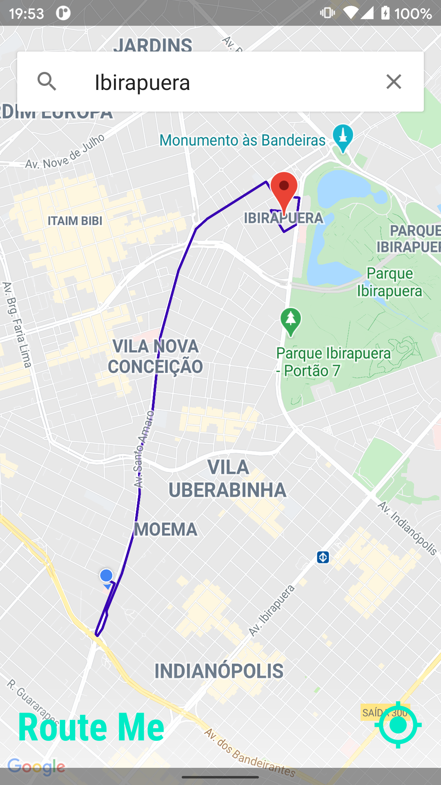

  
  
  <h3 align="center">Route Me</h3>

  

    Simple App to study Maps, Places and Direction APIs
     
  

## Table of contents

- [Quick start](#quick-start)
- [Description](#description)
- [Missing](#missing)
- [Images](#images)
- [Creators](#creators)

## Quick start

- Create a Maps Key for your project:
- - https://console.cloud.google.com/home/dashboard
- Let the key without restriction and enable billing
- Enable `Places API`, `Maps SDK for Android` and `Directions API`
- duplicate the folder release and rename it to debug in: `app/src`
- place your key in the `app/src/debug/res/values/google_maps_key.xml`
- Run the app

## Description

This app is a naive implementation of some maps and location features using the MVVM architecture:

- Asking Location Permission
- Find the current location using FusedLocationProviderClient,
- Draw a route in Map
- Use Places to get autocomplete and suggestions
- Use the Directions API to get the best route.

The directions API is not intented to be used like in this app, it must be consumed by a web server. The use of this API was simplified here using a third party lib: `'com.github.jd-alexander:library:1.1.0'`.

## Images

## Missing

It is currently missing Unit Tests, once the most part of the development depends on the framework, it was postponed.

## Creators

**Helton Isac**

- <https://github.com/helton-isac>
